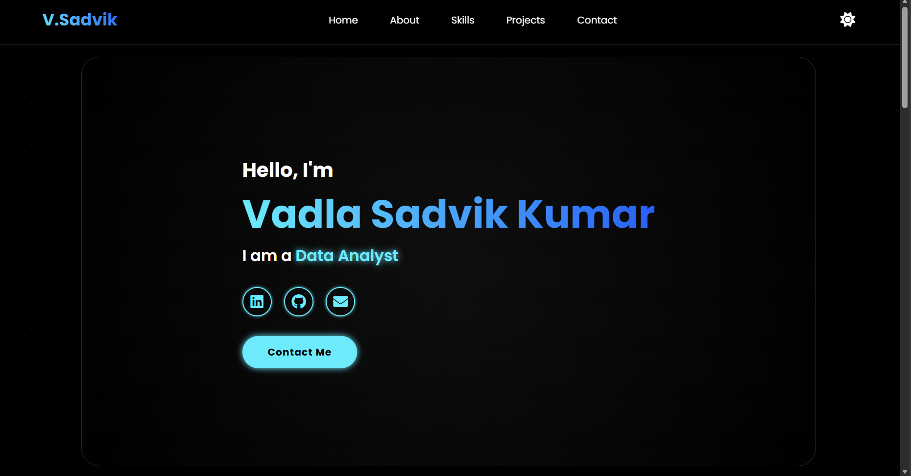

# ⚡ Personal Portfolio Website - Vadla Sadvik Kumar

  

A fully responsive, interactive personal portfolio website designed to showcase my projects in **AIML, Python, and Data Science**. 

This site features a modern **Dark/Light theme toggle**, **Scroll Reveal animations**, and a **Neon Glassmorphism** aesthetic.

🔗 **Live Demo:**

---

## 📸 Screenshots

 

---

## 🚀 Features

* **🎨 Dynamic Theme Switcher:** * **Dark Mode:** Deep black backgrounds with Neon Cyan/Electric Blue accents.
    * **Light Mode:** Clean professional white/silver backgrounds with dark text.
* **✨ Interactive UI:**
    * **Hover Effects:** "Lightning" glow effects on buttons and cards.
    * **Gradient Text:** Two-tone gradient headings (Cyan to Blue).
    * **Typewriter Effect:** Animated intro text.
* **📱 Fully Responsive:** Optimized for Desktops, Tablets, and Mobile devices.
* **🎬 Scroll Animations:** Elements slide, fade, and zoom in as you navigate (powered by ScrollReveal.js).
* **📂 Structured Sections:**
    * **Home:** Full-screen hero landing with social links.
    * [cite_start]**About:** Timeline of Education[cite: 5, 8].
    * [cite_start]**Skills:** Categorized technical stack (Python, AIML, Web)[cite: 15].
    * [cite_start]**Projects:** Showcase of "Echo-Guard", Salary Prediction, and more[cite: 17, 24].

---

## 🛠️ Tech Stack

* **Frontend:** HTML5, CSS3 (CSS Variables, Flexbox, Grid)
* **Scripting:** Vanilla JavaScript (ES6+)
* **Libraries:** * [ScrollReveal.js](https://scrollrevealjs.org/) (Animations)
    * [FontAwesome](https://fontawesome.com/) (Icons)
* **Fonts:** Poppins (Google Fonts)

---

## 📂 Project Structure

```bash
portfolio/
├── index.html      # Main HTML structure
├── style.css       # All styling, variables, and animations
├── script.js       # Logic for Toggle, Typing, and Scroll Reveal
└── README.md       # Project documentation
